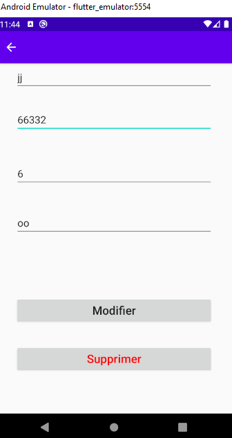

#README  application images

this is an application to (add , delete , update) medicins that contain 14 column 
with  firbase ml-kit OCR to extract text for image and bar code scanner  to extract bar codes
the application stores new content in mobile and firbase database but you must configure firebase localy to you account to use OCR and store in firbase,  also this app use sqllite to store data and room data base with mvvm architecture 

you can clone it and just configure firebase and modifier column as you want

Note : i included an apk file called (medicin_app_apk.apk) you can download it and test the application directly

